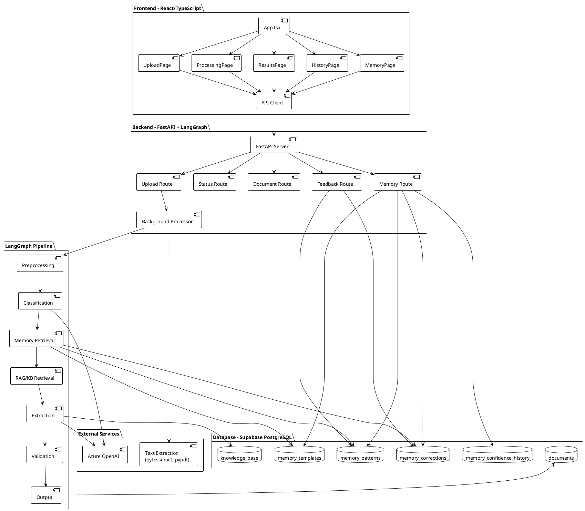
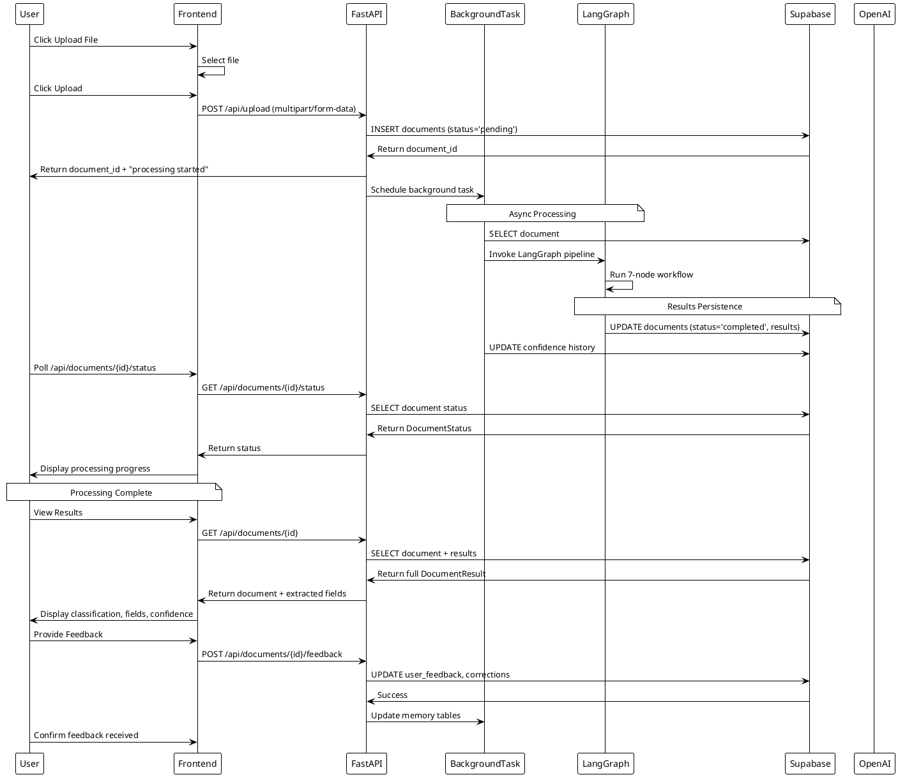
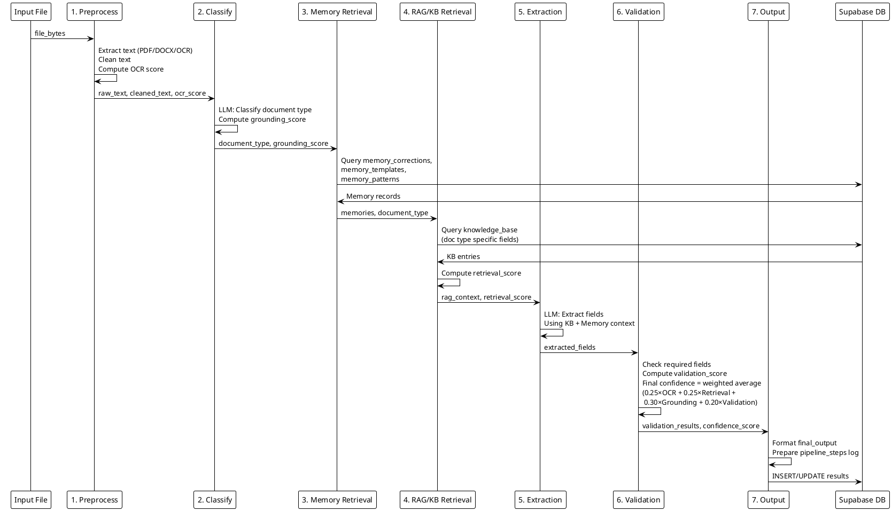
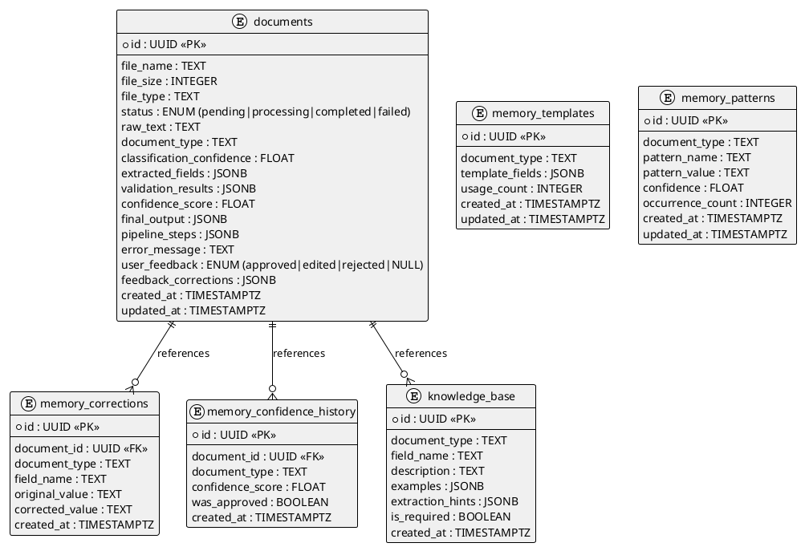
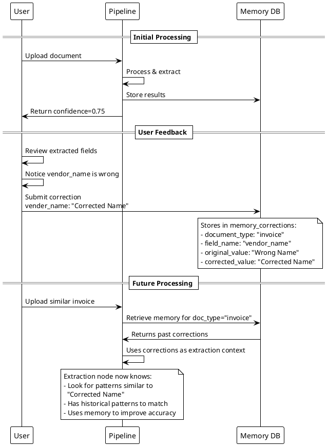

# AccuParse: Intelligent Document Classifier - Architecture Documentation

## Table of Contents
1. [System Overview](#system-overview)
2. [Architecture Diagram](#architecture-diagram)
3. [Technology Stack](#technology-stack)
4. [System Components](#system-components)
5. [Data Flow](#data-flow)
6. [Pipeline Workflow](#pipeline-workflow)
7. [Confidence Scoring](#confidence-scoring)
8. [Database Schema](#database-schema)
9. [API Endpoints](#api-endpoints)
10. [Memory & Learning System](#memory--learning-system)

---

## System Overview

**AccuParse** is an AI-powered document classification and field extraction system that uses LangGraph for orchestrating a multi-stage processing pipeline. It intelligently classifies documents, extracts structured fields, and learns from user feedback to improve future predictions.

### Key Features
- **Document Classification**: Automatically identifies document type (invoice, contract, resume, report, etc.)
- **Field Extraction**: Intelligently extracts relevant data fields using LLM and knowledge base
- **Confidence Scoring**: Composite confidence score from 4 metrics (OCR, Retrieval, Grounding, Validation)
- **Memory & Learning**: Stores corrections and patterns to improve future processing
- **Real-time Processing**: Background task processing with status tracking
- **Multi-document Support**: Handles PDF, DOCX, images, and plain text

---

## Architecture Diagram

### System-Level Architecture



---

## Technology Stack

### Frontend
| Technology | Purpose |
|------------|---------|
| **React 18.3** | UI framework |
| **TypeScript** | Type-safe development |
| **Vite 5.4** | Build tool & dev server |
| **Tailwind CSS 3.4** | Styling |
| **Lucide React** | Icon components |
| **Supabase JS Client** | Database interactions |

### Backend
| Technology | Purpose |
|------------|---------|
| **FastAPI 0.115** | REST API framework |
| **Python 3.11+** | Backend language |
| **Uvicorn** | ASGI server |
| **LangGraph 0.2.60** | Orchestration & pipeline |
| **LangChain 0.3.13** | LLM abstractions |
| **Azure OpenAI API** | LLM (GPT) |
| **pypdf 5.1** | PDF text extraction |
| **python-docx 1.1** | Word document parsing |
| **pytesseract + Pillow** | OCR for images |
| **Supabase 2.10** | Database client |

### Database
| Technology | Purpose |
|------------|---------|
| **PostgreSQL (Supabase)** | Primary datastore |
| **JSON/JSONB** | Flexible field storage |
| **Row Level Security (RLS)** | Access control |

---

## System Components

### 1. Frontend Components

#### Page-Level Components
```
src/components/pages/
├── UploadPage.tsx      - File upload interface
├── ProcessingPage.tsx  - Real-time pipeline status monitoring
├── ResultsPage.tsx     - Document results and field extraction display
├── HistoryPage.tsx     - Document history and past results
└── MemoryPage.tsx      - Memory store visualization (corrections, patterns, templates)
```

#### UI Components
```
src/components/ui/
├── Badge.tsx           - Status badges (pending, processing, completed, failed)
├── ConfidenceBar.tsx   - Visual confidence score display
├── JsonViewer.tsx      - Expandable JSON visualization
├── PipelineStatus.tsx  - Pipeline step progress indicator
└── Spinner.tsx         - Loading animation
```

### 2. Backend Structure

```
backend/
├── main.py             - FastAPI app, routes, background processing
├── db/
│   └── client.py       - Supabase connection & client singleton
├── graph/
│   ├── workflow.py     - LangGraph pipeline builder
│   ├── state.py        - Document state schema
│   └── nodes.py        - 7-node pipeline implementation
├── models/
│   └── schemas.py      - Pydantic models for API contracts
└── services/
    ├── document_parser.py  - PDF/DOCX/Image text extraction
    └── memory_service.py   - Memory CRUD operations
```

---

## Data Flow

### Upload & Processing Flow



### Internal Pipeline Data Flow



---

## Pipeline Workflow

### 7-Stage LangGraph Pipeline

```plantuml
@startuml LangGraph_Workflow
!theme plain
skinparam nodeBackgroundColor #e1f5ff
skinparam nodeBorderColor #01579b
skinparam noteBackgroundColor #fff9c4
skinparam noteBorderColor #f57f17

state "1. Preprocessing" as s1 {
    note right of s1
        Input: file_bytes, filename
        Process:
        • Extract text (pytesseract/pypdf/docx)
        • Clean/normalize text
        • Compute OCR quality score
        Output: raw_text, cleaned_text, 
                file_type, ocr_score
    end note
}

state "2. Classification" as s2 {
    note right of s2
        Input: cleaned_text
        Process:
        • LLM classifies document type
        • Supports 10 document types
        • Compute grounding score
        Output: document_type,
                classification_confidence,
                grounding_score
    end note
}

state "3. Memory Retrieval" as s3 {
    note right of s3
        Input: document_type
        Process:
        • Query user corrections
        • Retrieve templates
        • Load patterns
        • Fetch confidence history
        Output: memories (dict)
    end note
}

state "4. RAG/KB Retrieval" as s4 {
    note right of s4
        Input: document_type, memories
        Process:
        • Query knowledge_base
        • Compute retrieval_score
        • Prepare extraction hints
        Output: rag_context,
                retrieval_score
    end note
}

state "5. Field Extraction" as s5 {
    note right of s5
        Input: cleaned_text, rag_context, memories
        Process:
        • LLM extracts ALL fields
        • Prioritize required fields
        • Use KB & memory as context
        Output: extracted_fields (dict)
    end note
}

state "6. Validation & Scoring" as s6 {
    note right of s6
        Input: extracted_fields, rag_context,
               ocr_score, retrieval_score,
               grounding_score
        Process:
        • Validate field presence
        • Check required fields
        • Compute validation_score
        • Calculate final confidence:
          0.25×OCR + 0.25×Retrieval +
          0.30×Grounding + 0.20×Validation
        Output: validation_results,
                confidence_score
    end note
}

state "7. Output Formatting" as s7 {
    note right of s7
        Input: All pipeline data
        Process:
        • Format final output
        • Prepare pipeline_steps log
        • Persist to database
        Output: final_output,
                pipeline_steps
    end note
}

[*] --> s1
s1 --> s2 : DocumentState flows through
s2 --> s3 : Merged with classification result
s3 --> s4 : Memory added to state
s4 --> s5 : RAG context provided
s5 --> s6 : Extracted fields validated
s6 --> s7 : Confidence scores computed
s7 --> [*] : Results persisted to DB

@enduml
```

### Document Type Support

| Document Type | Use Cases | Key Fields |
|---------------|-----------|-----------|
| **invoice** | Bills, purchase orders, lab invoices | invoice_number, vendor_name, total_amount, line_items, due_date |
| **contract** | Agreements, NDAs, legal documents | parties, effective_date, termination_date, governing_law |
| **resume** | CV, job applications | name, email, skills, experience, education |
| **report** | Business/financial reports, research | title, summary, date, sections, conclusions |
| **letter** | Correspondence, memos, emails | sender, recipient, date, content |
| **form** | Applications, questionnaires | form_name, fields, submission_date |
| **receipt** | Point-of-sale, transaction confirmations | transaction_id, date, items, total, payment_method |
| **claims_document** | Insurance claims, CDR reports | claim_number, date, amount, claim_type |
| **medical_bill** | Hospital bills, lab invoices | patient_name, date_of_service, procedures, total_cost |
| **medical_report** | Clinical notes, discharge summaries | patient_info, diagnosis, treatments, medications |
| **other** | Unrecognized or miscellaneous | (variable) |

---

## Confidence Scoring

### Composite Confidence Formula

$$\text{FinalConfidence} = 0.25 \times \text{OCR} + 0.25 \times \text{Retrieval} + 0.30 \times \text{Grounding} + 0.20 \times \text{Validation}$$

### Component Scores

#### 1. **OCR Score** (0.0 - 1.0) - 25% weight
**Measures**: Quality of text extraction from document

| Factor | Calculation |
|--------|------------|
| **Text Length** | Length-based heuristic (longer = higher, capped at 2000 chars) |
| **Character Quality** | Ratio of meaningful printable characters |
| **File Type Factor** | PDF/Text (1.0) > DOCX (0.95) > Images (0.80) |
| **Formula** | `length_score × 0.55 + quality_ratio × 0.30 + type_factor × 0.15` |

#### 2. **Retrieval Score** (0.0 - 1.0) - 25% weight
**Measures**: Quality of relevant knowledge base and memory context found

| Factor | Calculation |
|--------|------------|
| **KB Coverage** | Based on # of KB entries found for doc type |
| **Memory Bonus** | +0.015 per memory record (max +0.15) |
| **Formula** | `kb_score + min(0.15, memory_records × 0.015)` |

#### 3. **Grounding Score** (0.0 - 1.0) - 30% weight
**Measures**: Model's confidence in document classification

- Directly equals the classification confidence returned by LLM
- Range: 0.0 (very uncertain) to 1.0 (very confident)
- LLM temperature: 0.1 (deterministic, focused)

#### 4. **Validation Score** (0.0 - 1.0) - 20% weight
**Measures**: Quality of extracted fields and field presence

| Factor | Weight |
|--------|--------|
| **Required Fields Present** | 2.0× |
| **Optional Fields Present** | 1.0× |
| **Missing Required Fields** | Penalty (0.0 for that field) |
| **Formula** | `weighted_sum / weighted_total` (normalized 0-1) |

### Score Interpretation

| Score Range | Interpretation | Action |
|------------|-----------------|--------|
| **0.85 - 1.00** | High confidence, reliable extraction | ✓ Auto-approve |
| **0.70 - 0.84** | Good confidence, minor review suggested | ⚠ Review recommended |
| **0.50 - 0.69** | Moderate confidence, review suggested | 🔍 Manual review |
| **0.30 - 0.49** | Low confidence, unreliable | ❌ Requires corrections |
| **< 0.30** | Very low confidence, likely errors | ❌ Reject & retry |

---

## Database Schema

### Entity Relationship Diagram



### Table Descriptions

#### **documents**
Primary table storing uploaded documents and processing results.

| Column | Type | Purpose |
|--------|------|---------|
| `id` | UUID | Unique document identifier |
| `status` | ENUM | Pipeline state (pending → processing → completed/failed) |
| `extracted_fields` | JSONB | LLM-extracted structured data |
| `pipeline_steps` | JSONB | Array tracking each pipeline stage execution |
| `confidence_score` | FLOAT | Final composite confidence (0.0-1.0) |
| `user_feedback` | ENUM | User approval status for learning |

#### **memory_corrections**
Stores user corrections for model learning.
- Enables the system to improve field extraction over time
- Used by extraction node as context for future processing

#### **memory_templates**
Learned document templates per document type.
- Tracks `usage_count` to identify commonly processed templates
- Helps extract consistent field schemas

#### **memory_patterns**
Pattern records from extracted fields.
- Stores patterns like "invoice_numbers start with INV-"
- Includes `confidence` and `occurrence_count` metrics

#### **memory_confidence_history**
Historical confidence tracking.
- Enables confidence trend analysis
- Tracks `was_approved` to correlate confidence with user validation

#### **knowledge_base**
Domain knowledge for RAG retrieval.
- Pre-populated with field definitions and extraction hints
- Indexed by `document_type` and `field_name`
- Example entries for invoice, contract, resume fields

---

## API Endpoints

### Health Check
```
GET /api/health
Response: { "status": "ok", "service": "document-classifier" }
```

### Document Upload
```
POST /api/upload
Content-Type: multipart/form-data

Request:
  file: <binary file>

Response:
  {
    "document_id": "uuid",
    "message": "Document uploaded and processing started"
  }

Status: 202 Accepted (background processing initiated)
Error: 400 (unsupported file type or >20MB)
```

**Supported File Types**: PDF, DOCX, DOC, TXT, CSV, PNG, JPG, JPEG, TIFF, BMP

### Get Document Status (Polling)
```
GET /api/documents/{document_id}/status

Response:
  {
    "id": "uuid",
    "file_name": "invoice.pdf",
    "status": "processing|completed|failed",
    "document_type": "invoice",
    "classification_confidence": 0.92,
    "confidence_score": 0.87,
    "pipeline_steps": [
      { "name": "Preprocessing", "status": "completed", "output": "..." },
      { "name": "Classification", "status": "completed", "output": "..." },
      ...
    ],
    "created_at": "2024-06-18T10:30:00Z"
  }
```

### Get Full Document Result
```
GET /api/documents/{document_id}

Response:
  {
    "id": "uuid",
    "file_name": "invoice.pdf",
    "file_type": "application/pdf",
    "status": "completed",
    "raw_text": "...",
    "document_type": "invoice",
    "classification_confidence": 0.92,
    "extracted_fields": {
      "invoice_number": "INV-2024-001",
      "vendor_name": "Acme Corp",
      "total_amount": "$1,250.00",
      "due_date": "2024-07-15",
      "line_items": [...]
    },
    "validation_results": {
      "missing_required": [],
      "field_scores": { "invoice_number": 1.0, ... },
      "field_status": { "invoice_number": "required_extracted", ... }
    },
    "confidence_score": 0.87,
    "final_output": { ... },
    "pipeline_steps": [...],
    "user_feedback": null|"approved"|"edited"|"rejected",
    "feedback_corrections": {...},
    "created_at": "2024-06-18T10:30:00Z",
    "updated_at": "2024-06-18T10:35:00Z"
  }
```

### List Documents
```
GET /api/documents?limit=50&offset=0

Response:
  [
    { ... document object ... },
    { ... document object ... }
  ]
```

### Submit Feedback
```
POST /api/documents/{document_id}/feedback
Content-Type: application/json

Request:
  {
    "feedback": "approved|edited|rejected",
    "corrections": {
      "vendor_name": "Corrected Company Name",
      "total_amount": "USD 1,500.00"
    }
  }

Response:
  {
    "message": "Feedback recorded",
    "document_id": "uuid"
  }

Side Effects:
  • Updates document.user_feedback & feedback_corrections
  • Records confidence history
  • Stores corrections for learning
  • Updates patterns & templates
```

### Get Memory Store
```
GET /api/memory

Response:
  {
    "corrections": [ ... memory_corrections rows ... ],
    "templates": [ ... memory_templates rows ... ],
    "patterns": [ ... memory_patterns rows ... ],
    "confidence_history": [ ... memory_confidence_history rows ... ]
  }
```

### Delete Document
```
DELETE /api/documents/{document_id}

Response: 200 OK

Side Effects:
  • Document and all related memory records deleted (CASCADE)
```

---

## Memory & Learning System

### How the System Learns



### Memory Components

#### 1. **Corrections Memory**
- **Purpose**: Store user-provided field corrections
- **Used by**: Extraction node (as context hints)
- **Example**: User corrects vendor name → future extractions use this as pattern
- **Query**: `memory_corrections WHERE document_type = ?`

#### 2. **Templates Memory**
- **Purpose**: Track document structure templates per type
- **Used by**: Extraction node (for field schema awareness)
- **Tracking**: `usage_count` to identify most-used templates
- **Example**: Invoice template with fields: [invoice_number, vendor_name, total_amount, ...]

#### 3. **Patterns Memory**
- **Purpose**: Store extracted field patterns and values
- **Used by**: Extraction node (for value validation)
- **Tracking**: `occurrence_count` for statistical pattern strength
- **Example**: invoice_numbers: ["INV-*", "2024-*"] (occurrence_count: 45)

#### 4. **Confidence History**
- **Purpose**: Track confidence trends per document type
- **Used by**: Analytics/monitoring
- **Tracking**: `was_approved` to correlate confidence with acceptance
- **Benefit**: Identify if system improves over time

#### 5. **Knowledge Base**
- **Purpose**: Domain-specific field definitions and extraction hints
- **Pre-populated**: Yes (seeded during migration)
- **Used by**: RAG retrieval node (during extraction)
- **Structure**:
  ```json
  {
    "document_type": "invoice",
    "field_name": "invoice_number",
    "description": "Unique identifier for the invoice",
    "examples": ["INV-001", "2024-0123"],
    "extraction_hints": ["Look for INV-", "Usually near top"],
    "is_required": true
  }
  ```

---

## Data Processing Workflow Detail

### Step 1: Preprocessing

**Input**: Binary file bytes  
**Process**:
1. Detect file type (PDF, DOCX, image, etc.)
2. Extract raw text using appropriate parser:
   - **PDF**: `pypdf` library
   - **DOCX**: `python-docx` library
   - **Images**: `pytesseract` + `Pillow` (OCR)
   - **Text**: Direct read
3. Clean text:
   - Normalize whitespace
   - Remove control characters
   - Decode special characters
4. Compute OCR quality score based on text length, character quality, file type

**Output**: `raw_text`, `cleaned_text`, `file_type`, `ocr_score`

### Step 2: Classification

**Input**: `cleaned_text`  
**Process**:
1. Prepare system prompt with supported document types
2. Call Azure OpenAI with document snippet
3. LLM returns: `{ document_type, confidence, reasoning }`
4. `grounding_score = classification_confidence`

**Output**: `document_type`, `classification_confidence`, `grounding_score`, `classification_reasoning`

### Step 3: Memory Retrieval

**Input**: `document_type`  
**Process**:
1. Query `memory_corrections` table for corrections of this type
2. Query `memory_templates` table for learned templates
3. Query `memory_patterns` table for extraction patterns
4. Query `memory_confidence_history` for confidence stats

**Output**: `memories` dict containing all 4 memory types

### Step 4: RAG / Knowledge Base Retrieval

**Input**: `document_type`, `memories`  
**Process**:
1. Query `knowledge_base` filtered by `document_type`
2. Build context with field descriptions, examples, extraction hints
3. Mark required vs optional fields from KB
4. Compute retrieval_score based on KB entries found + memory records

**Output**: `rag_context` (list of KB entries), `retrieval_score`

### Step 5: Field Extraction

**Input**: `cleaned_text`, `rag_context`, `memories`  
**Process**:
1. Build comprehensive extraction prompt including:
   - Required fields from KB (with extraction hints)
   - Optional fields from KB
   - Past user corrections (as examples)
   - Past field patterns
2. Call Azure OpenAI with full document text
3. Parse JSON response with extracted fields

**Output**: `extracted_fields` (dict of all extracted field:value pairs)

### Step 6: Validation & Confidence Scoring

**Input**: `extracted_fields`, `rag_context`, `ocr_score`, `retrieval_score`, `grounding_score`  
**Process**:
1. Check each required field for presence
2. Build `validation_results`:
   - `field_scores`: presence score per field
   - `field_status`: "required_extracted", "required_missing", "optional_present", etc.
   - `missing_required`: list of missing required fields
3. Compute `validation_score` from field presence weighted average
4. **Calculate final confidence**:
   $$\text{confidence} = 0.25 \times \text{ocr} + 0.25 \times \text{retrieval} + 0.30 \times \text{grounding} + 0.20 \times \text{validation}$$

**Output**: `validation_results`, `confidence_score` (0.0-1.0)

### Step 7: Output Formatting

**Input**: All previous state  
**Process**:
1. Format final output combining all results
2. Prepare pipeline_steps array with execution details
3. Persist to database

**Output**: `final_output`, `pipeline_steps`

---

## Frontend State Management

```
App.tsx (main state)
├── page: 'upload' | 'processing' | 'results' | 'history' | 'memory'
├── activeDocId: string | null
├── sidebarOpen: boolean
└── apiStatus: 'checking' | 'ok' | 'error'

Navigation:
├── Upload Page
│   └── UploadPage.tsx
│       ├── File input
│       └── Upload handler → POST /api/upload
│
├── Processing Page
│   └── ProcessingPage.tsx
│       ├── Polling: GET /api/documents/{id}/status
│       ├── PipelineStatus component (shows step progress)
│       └── Auto-advance to Results on completion
│
├── Results Page
│   └── ResultsPage.tsx
│       ├── GET /api/documents/{id} → full results
│       ├── JsonViewer component (display extracted_fields)
│       ├── ConfidenceBar component (show confidence_score)
│       ├── Badge component (status badge)
│       └── Feedback form (POST /api/documents/{id}/feedback)
│
├── History Page
│   └── HistoryPage.tsx
│       ├── GET /api/documents?limit=50
│       ├── Display document list
│       └── Click → view document in Results
│
└── Memory Page
    └── MemoryPage.tsx
        ├── GET /api/memory → all memory store
        ├── Display corrections, patterns, templates
        └── Show confidence trends
```

---

## Key Design Decisions

### 1. **Background Processing**
- Uploads are async: immediate response, background processing
- Status polling keeps user informed without blocking
- Prevents timeout on large documents

### 2. **Composite Confidence Scoring**
- 4-component formula balances different error sources
- 30% weighting on "grounding" reflects LLM understanding importance
- Field validation (20%) ensures structural correctness
- Transparent scoring enables user trust

### 3. **Memory-Augmented Extraction**
- User corrections immediately become context for future extractions
- Enables continuous improvement without model retraining
- Cost-effective: LLM-in-the-loop learning

### 4. **Required vs Optional Fields**
- KB separates required from optional fields
- Validation penalizes missing required fields
- Allows flexible extraction of additional fields

### 5. **Multi-Stage Processing**
- LangGraph enables sequential, trackable pipeline
- Each stage has clear inputs/outputs
- Easy to add/modify stages or add conditional branching

### 6. **Database Schema Flexibility**
- JSONB for extracted_fields, final_output, pipeline_steps
- Allows different document types to have different field schemas
- Maintains structured data for query-ability

---

## Performance Considerations

### Bottlenecks

| Component | Latency | Mitigation |
|-----------|---------|-----------|
| **Text Extraction (OCR)** | 2-10s per image | Async background processing |
| **LLM Calls** | 1-5s per call | 2 calls (classify + extract) per doc |
| **Database Queries** | 10-100ms | Indexed queries, connection pooling |
| **File Upload** | Variable | 20MB size limit |

### Optimization Strategies

1. **Async Processing**: Background tasks don't block API
2. **Caching**: Templates and patterns reduce memory queries
3. **Prompt Optimization**: Concise prompts reduce LLM tokens
4. **Indexing**: DB indexes on `document_type`, `document_id`

---

## Security & Access Control

### Database Security
- **Row Level Security (RLS)**: Enabled on all tables
- **Public Access**: Current policies allow anon + authenticated users (demo mode)
- **Production**: Should restrict to authenticated users

### API Security
- **CORS**: Currently allows all origins (demo mode)
- **File Size Limit**: 20MB max
- **File Type Validation**: Whitelist of supported formats

### LLM API Security
- **Environment Variables**: API keys stored in `.env`
- **Temperature: 0.1**: Low randomness, deterministic output
- **Token Limits**: 4000 max_tokens per call

---

## Future Enhancement Ideas

### 1. **Conditional Pipeline Branching**
- Skip RAG for simple documents
- Route to specialized extractors per document type
- Fallback to manual review for low-confidence extractions

### 2. **Advanced Memory Management**
- Similarity clustering of patterns
- Automatic outlier detection
- Confidence-weighted pattern voting

### 3. **Model Fine-tuning**
- Aggregate successful corrections into fine-tuning dataset
- Periodic model adaptation to domain specifics

### 4. **Batch Processing**
- Bulk upload & processing
- Scheduled recurring processing

### 5. **Real-time Collaboration**
- WebSocket updates instead of polling
- Shared document review sessions

### 6. **Advanced Analytics**
- Confidence trends per document type
- Extraction accuracy metrics
- Performance dashboards

### 7. **Multi-Language Support**
- Automatic language detection
- Multi-lingual extraction & classification

---

## Troubleshooting Guide

### **Issue: Document stuck in "processing" state**
**Diagnosis**:
- Check backend logs for errors in `/api/documents/{id}/status`
- Verify LLM API credentials in `.env`
- Check Supabase connection

**Resolution**:
- Restart FastAPI server
- Verify AZURE_OPENAI_* environment variables
- Check network connectivity to Azure & Supabase

### **Issue: Low confidence scores (<0.5)**
**Diagnosis**:
- Check `pipeline_steps` for which component failed
- Review `validation_results.missing_required` for missing fields

**Resolution**:
- Ensure document quality (good image scan/PDF)
- Add missing fields to knowledge_base
- Provide user corrections to improve memory

### **Issue: Wrong document type classification**
**Diagnosis**:
- Check `document_type` and `classification_confidence`
- Review LLM response in `classification_reasoning`

**Resolution**:
- Verify document is correct type
- Check knowledge_base seeds for that type
- Report as feedback to improve training data

### **Issue: Database errors**
**Diagnosis**:
- Check `.env` for Supabase credentials
- Verify migrations ran successfully
- Check `documents` table exists

**Resolution**:
- Re-run migrations: `supabase db push`
- Verify Supabase project is active
- Check RLS policies are in place

---

## Summary

**AccuParse** is a sophisticated document processing system that combines:
- ✅ **Intelligent Classification**: LLM-powered document type identification
- ✅ **Smart Extraction**: Context-aware field extraction with KB + memory
- ✅ **Confidence Scoring**: Transparent 4-component confidence formula
- ✅ **Continuous Learning**: Memory system improves accuracy over time
- ✅ **User Feedback Loop**: Integrated corrections feed back into system
- ✅ **Real-time Processing**: Async pipeline with status tracking
- ✅ **Flexible Architecture**: LangGraph enables easy modifications

The system balances **accuracy, transparency, and continuous improvement** through a well-architected pipeline that leverages LLMs, knowledge bases, and user feedback.

