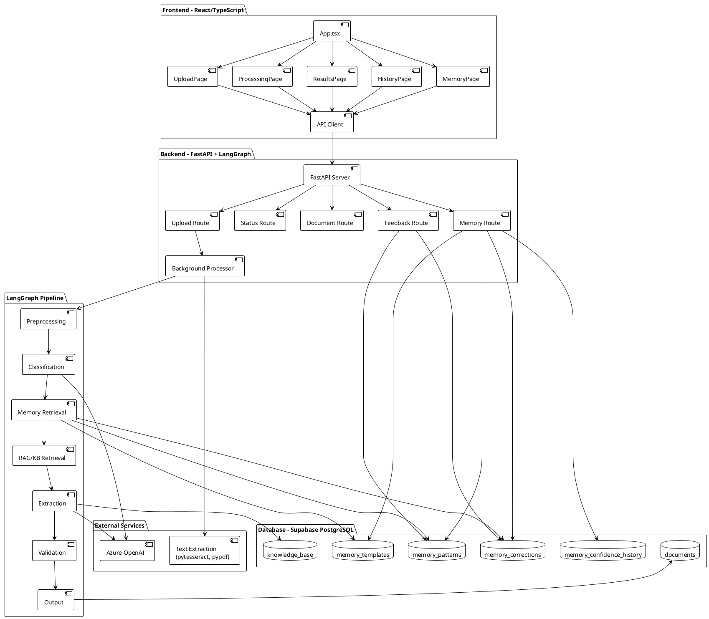
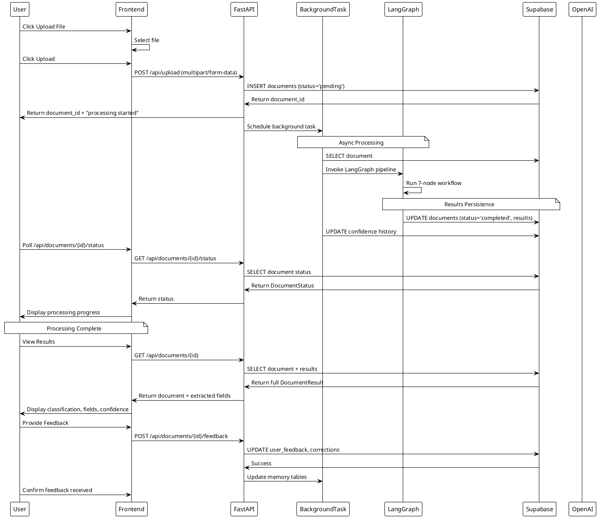
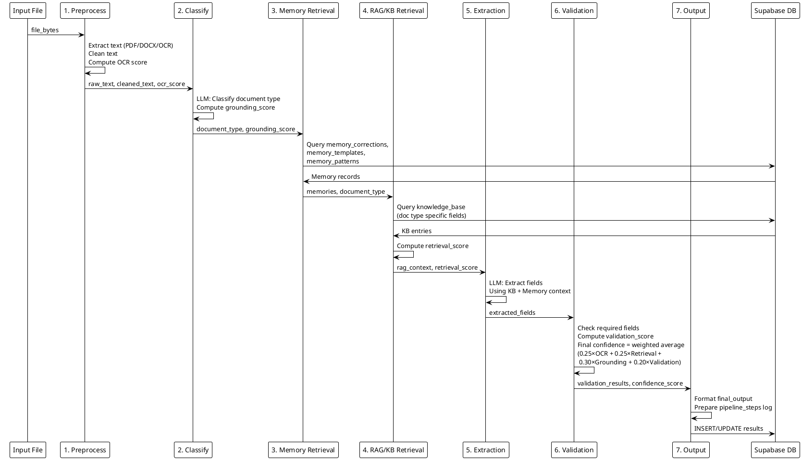
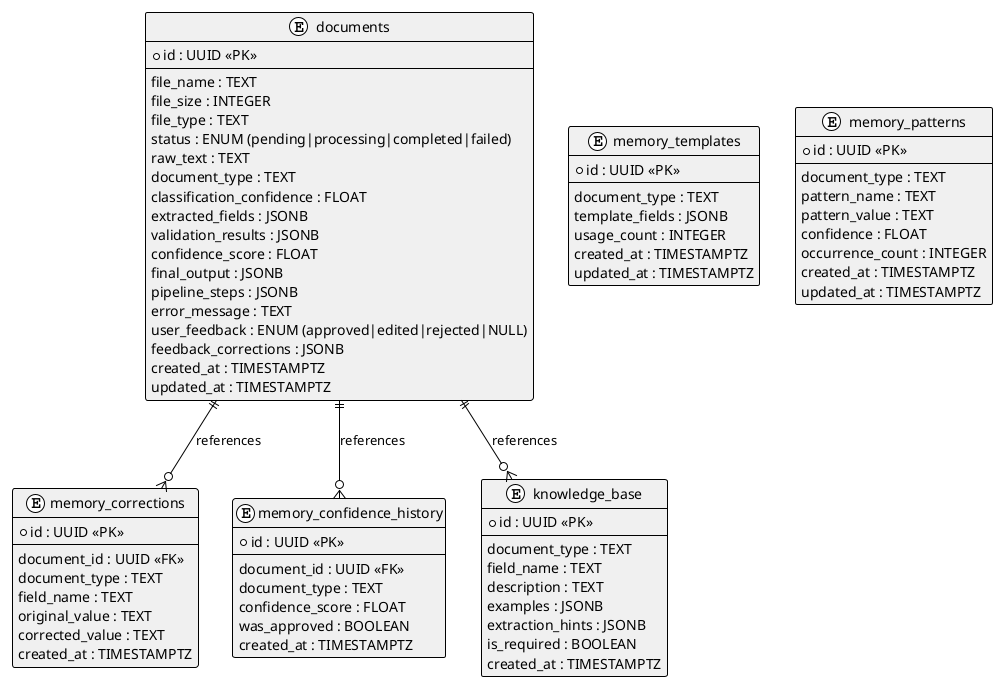
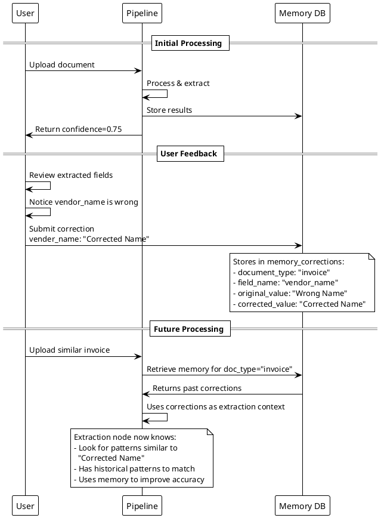
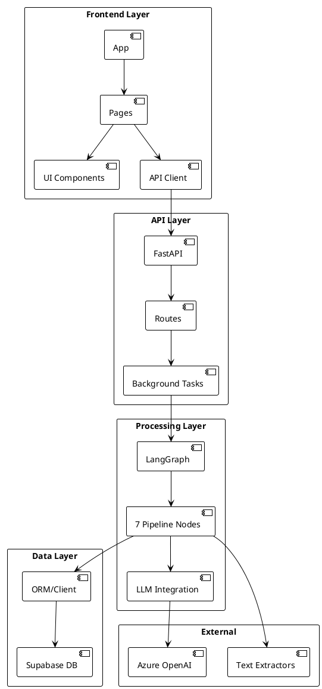
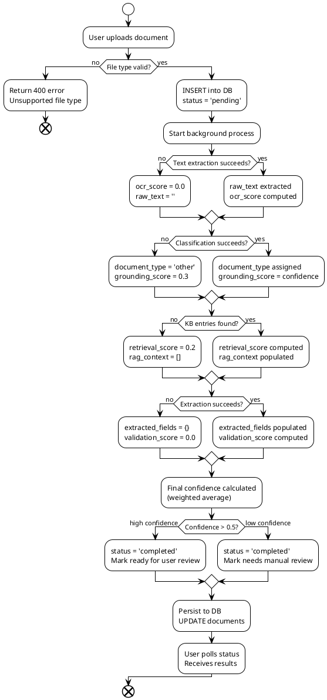
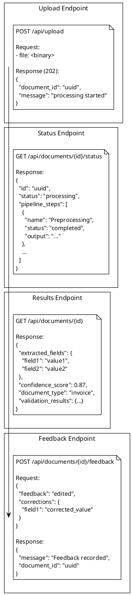

# AccuParse Architecture PlantUML Diagrams

## 1. Complete System Architecture



---

## 2. Upload & Processing Flow



---

## 3. Pipeline Data Flow



---

## 4. LangGraph Pipeline States

```plantuml
@startuml LangGraph_Workflow
!theme plain
skinparam nodeBackgroundColor #e1f5ff
skinparam nodeBorderColor #01579b
skinparam noteBackgroundColor #fff9c4
skinparam noteBorderColor #f57f17

state "1. Preprocessing" as s1 {
    note right of s1
        Input: file_bytes, filename
        Process:
        • Extract text (pytesseract/pypdf/docx)
        • Clean/normalize text
        • Compute OCR quality score
        Output: raw_text, cleaned_text, 
                file_type, ocr_score
    end note
}

state "2. Classification" as s2 {
    note right of s2
        Input: cleaned_text
        Process:
        • LLM classifies document type
        • Supports 10 document types
        • Compute grounding score
        Output: document_type,
                classification_confidence,
                grounding_score
    end note
}

state "3. Memory Retrieval" as s3 {
    note right of s3
        Input: document_type
        Process:
        • Query user corrections
        • Retrieve templates
        • Load patterns
        • Fetch confidence history
        Output: memories (dict)
    end note
}

state "4. RAG/KB Retrieval" as s4 {
    note right of s4
        Input: document_type, memories
        Process:
        • Query knowledge_base
        • Compute retrieval_score
        • Prepare extraction hints
        Output: rag_context,
                retrieval_score
    end note
}

state "5. Field Extraction" as s5 {
    note right of s5
        Input: cleaned_text, rag_context, memories
        Process:
        • LLM extracts ALL fields
        • Prioritize required fields
        • Use KB & memory as context
        Output: extracted_fields (dict)
    end note
}

state "6. Validation & Scoring" as s6 {
    note right of s6
        Input: extracted_fields, rag_context,
               ocr_score, retrieval_score,
               grounding_score
        Process:
        • Validate field presence
        • Check required fields
        • Compute validation_score
        • Calculate final confidence:
          0.25×OCR + 0.25×Retrieval +
          0.30×Grounding + 0.20×Validation
        Output: validation_results,
                confidence_score
    end note
}

state "7. Output Formatting" as s7 {
    note right of s7
        Input: All pipeline data
        Process:
        • Format final output
        • Prepare pipeline_steps log
        • Persist to database
        Output: final_output,
                pipeline_steps
    end note
}

[*] --> s1
s1 --> s2 : DocumentState flows through
s2 --> s3 : Merged with classification result
s3 --> s4 : Memory added to state
s4 --> s5 : RAG context provided
s5 --> s6 : Extracted fields validated
s6 --> s7 : Confidence scores computed
s7 --> [*] : Results persisted to DB

@enduml
```

---

## 5. Database Schema ERD



---

## 6. Continuous Learning Loop



---

## 7. Confidence Scoring Components

```plantuml
@startuml Confidence_Scoring
!theme plain
skinparam backgroundColor #ffffff
skinparam classBackgroundColor #fff3e0

component "OCR Score\n(0.25 weight)" as ocr {
    note
        Text Extraction Quality
        • Text length heuristic
        • Character quality ratio
        • File type factor
    end note
}

component "Retrieval Score\n(0.25 weight)" as retrieval {
    note
        Knowledge Base + Memory Coverage
        • KB entries found
        • Memory records count
        • Context richness
    end note
}

component "Grounding Score\n(0.30 weight)" as grounding {
    note
        Model Understanding
        • LLM classification confidence
        • Document type certainty
        • Direct from LLM output
    end note
}

component "Validation Score\n(0.20 weight)" as validation {
    note
        Field Extraction Quality
        • Required fields present
        • Optional fields extracted
        • Data completeness
    end note
}

frame "Final Confidence Formula" {
    [Score Aggregator]
    note right of [Score Aggregator]
        FinalConfidence = 
        0.25×OCR + 0.25×Retrieval +
        0.30×Grounding + 0.20×Validation
    end note
}

ocr --> [Score Aggregator]
retrieval --> [Score Aggregator]
grounding --> [Score Aggregator]
validation --> [Score Aggregator]

[Score Aggregator] --> [Confidence Output (0.0-1.0)]

@enduml
```

---

## 8. Component Interaction Matrix



---

## 9. Frontend Navigation & State Flow

```plantuml
@startuml Frontend_State_Flow
!theme plain
skinparam backgroundColor #ffffff

state App {
    state Upload {
        state [*] --> UploadForm
        state UploadForm: File Selection & Upload
        UploadForm --> [*]: Submit
    }
    
    state Processing {
        state [*] --> StatusPolling
        state StatusPolling: Poll /api/documents/{id}/status
        StatusPolling --> StatusPolling: Every 1-2s
        StatusPolling --> [*]: Processing Complete
    }
    
    state Results {
        state [*] --> LoadResults
        state LoadResults: GET /api/documents/{id}
        LoadResults --> DisplayFields: Parse Response
        state DisplayFields: Show extracted_fields\n+ confidence_score
        DisplayFields --> FeedbackForm: User Reviews
        state FeedbackForm: Approve/Edit/Reject
        FeedbackForm --> [*]: Submit Feedback
    }
    
    state History {
        state [*] --> ListDocs
        state ListDocs: GET /api/documents?limit=50
        ListDocs --> SelectDoc: Click Document
        SelectDoc --> Results: Navigate to Results
    }
    
    state Memory {
        state [*] --> LoadMemory
        state LoadMemory: GET /api/memory
        LoadMemory --> ViewMemory: Display corrections,\npatterns, templates
        ViewMemory --> [*]
    }
    
    [*] --> Upload
    Upload --> Processing: handleDocumentUploaded()
    Processing --> Results: handleProcessingComplete()
    Results --> History: User navigates
    Processing --> History: User navigates
    Results --> Upload: User navigates
    History --> Results: viewDocument(id)
    History --> Upload: User navigates
    Upload --> Memory: User navigates
    Memory --> Upload: User navigates
}

@enduml
```

---

## 10. Error Handling & Fallback Paths



---

## 11. API Request/Response Examples



